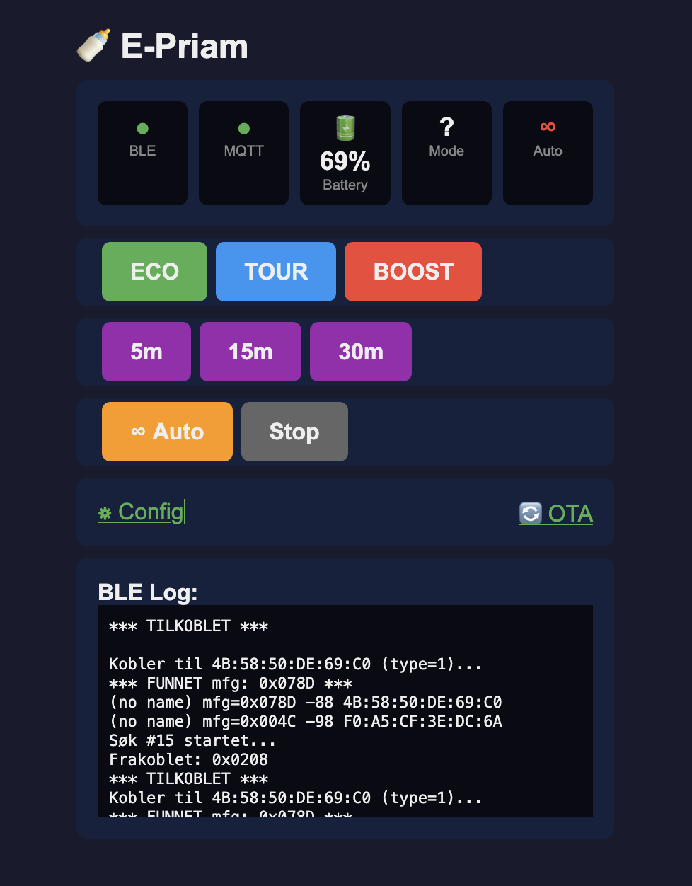

# esPriam32

A native ESP-IDF firmware for ESP32-C6 that acts as a BLE-to-WiFi bridge for the Cybex E-Priam stroller, enabling control via a web interface and Home Assistant integration.



## Features

- **BLE Connection** - Automatic discovery and connection to E-Priam stroller
- **Web Interface** - Beautiful mobile-friendly control panel
- **Home Assistant** - Full MQTT integration with auto-discovery
- **Rocking Control** - 5/15/30 minute timers with countdown display
- **Auto-Renew Mode** - Continuous rocking that auto-renews before timeout
- **Battery Monitoring** - Real-time battery percentage from stroller
- **Drive Modes** - ECO, TOUR, BOOST mode switching
- **OTA Updates** - Over-the-air firmware updates via web browser
- **Live BLE Log** - Real-time connection status in web UI

## Hardware Requirements

### Tested Hardware

This project has been developed and tested with:

- **Seeed Studio XIAO ESP32-C6** - Recommended, compact and reliable

### Compatible Hardware

Should work with any ESP32-C6 board, but only the XIAO ESP32-C6 has been verified:

| Board | Status | Notes |
|-------|--------|-------|
| Seeed XIAO ESP32-C6 | ✅ Tested | Recommended |
| ESP32-C6-DevKitC-1 | ⚠️ Untested | Should work |
| Other ESP32-C6 boards | ⚠️ Untested | Should work |

### Other Requirements

- Cybex E-Priam stroller with electronic drive unit
- WiFi network (2.4 GHz)
- USB-C cable for flashing
- Optional: MQTT broker for Home Assistant integration

## Quick Start

### 1. Install PlatformIO

```bash
pip install platformio
```

### 2. Configure WiFi and MQTT

Edit `src/main.c` and update these values:

```c
#define MQTT_BROKER "mqtt://YOUR_MQTT_BROKER_IP"
#define MQTT_USER "your_mqtt_username"
#define MQTT_PASS "your_mqtt_password"

#define WIFI_SSID "YourWiFiNetwork"
#define WIFI_PASS "YourWiFiPassword"
```

### 3. Build and Flash

```bash
pio run --target upload
```

### 4. Find the Device

After flashing, the ESP32-C6 will:
1. Connect to your WiFi network
2. Get an IP address via DHCP
3. Start scanning for the E-Priam stroller

Check your router's DHCP leases or use:
```bash
arp -a | grep -i espressif
```

## Web Interface

Access the web interface at `http://<device-ip>/`

### Status Bar

| Indicator | Description |
|-----------|-------------|
| BLE (green/red) | Connected to stroller |
| MQTT (green/red) | Connected to broker |
| Battery XX% | Stroller battery level |
| Mode | Current drive mode (ECO/TOUR/BOOST) |
| Auto (green/red) | Auto-renew status |

### Rocking Controls

| Button | Description |
|--------|-------------|
| **5m / 15m / 30m** | Start rocking with timer |
| **Auto** | Continuous rocking (auto-renews at 10 min remaining) |
| **Stop** | Stop rocking |

### Drive Mode Controls

| Button | Description |
|--------|-------------|
| **ECO** | Energy-saving mode |
| **TOUR** | Normal mode |
| **BOOST** | Maximum power mode |

### Additional Pages

| URL | Description |
|-----|-------------|
| `/` | Main control interface |
| `/config` | Configure entity names for Home Assistant |
| `/ota` | Upload new firmware over-the-air |
| `/api/status` | JSON status endpoint |
| `/api/log` | BLE log (newest first) |

## Home Assistant Integration

The device automatically publishes MQTT discovery messages. Entities appear automatically in Home Assistant.

### Entities Created

| Entity | Type | Description |
|--------|------|-------------|
| `sensor.epriam_battery` | Sensor | Battery percentage |
| `switch.epriam_rocking` | Switch | Rocking on/off |
| `switch.epriam_autorenew` | Switch | Auto-renew mode |
| `select.epriam_mode` | Select | Drive mode (ECO/TOUR/BOOST) |
| `number.epriam_intensity` | Number | Rocking intensity (0-100%) |
| `binary_sensor.epriam_connected` | Binary Sensor | BLE connection status |
| `sensor.epriam_ip` | Sensor | Device IP address |

### Example Automation

```yaml
automation:
  - alias: "Start rocking when baby monitor triggers"
    trigger:
      - platform: state
        entity_id: binary_sensor.baby_crying
        to: "on"
    action:
      - service: switch.turn_on
        target:
          entity_id: switch.epriam_autorenew
```

## REST API Reference

### Status Endpoint

```bash
curl http://<ip>/api/status
```

Response:
```json
{
  "connected": true,
  "mqtt": true,
  "battery": 69,
  "battery_leds": 2,
  "drive_mode": 1,
  "rocking": true,
  "auto_renew": false,
  "intensity": 50,
  "remaining_sec": 245,
  "rock_minutes": 5
}
```

### Control Endpoints

```bash
# Drive modes
curl http://<ip>/api/mode/eco
curl http://<ip>/api/mode/tour
curl http://<ip>/api/mode/boost

# Rocking control
curl "http://<ip>/api/rock/start?min=15&intensity=50"
curl http://<ip>/api/rock/stop
curl http://<ip>/api/rock/autorenew

# BLE scan
curl http://<ip>/api/rescan
```

## OTA Updates

1. Build new firmware:
   ```bash
   pio run
   ```

2. Navigate to `http://<device-ip>/ota`

3. Select file: `.pio/build/esp32-c6/firmware.bin`

4. Click "Start OTA" and wait for completion

5. Device reboots automatically

## Troubleshooting

### Device not connecting to stroller

1. Check the BLE log on the web interface
2. Ensure the stroller is powered on
3. Move ESP32-C6 closer (< 3 meters recommended)
4. Press "Scan" button in web UI
5. Check serial output: `pio device monitor`

### Weak BLE Signal

- RSSI should be above -85 dBm for reliable connection
- Optimal range is 1-2 meters from stroller
- The E-Priam BLE module (Microchip RN4871) has limited range

### MQTT Not Connecting

1. Verify broker IP, username, and password in code
2. Check that MQTT broker is running
3. Verify Home Assistant MQTT integration is configured

## Technical Details

### BLE Protocol

The E-Priam uses a Microchip RN4871 BLE module.

**Manufacturer ID:** `0x078D`

**Service UUID:** `a1fc0101-78d3-40c2-9b6f-3c5f7b2797df`

| Characteristic | UUID Suffix | Description |
|----------------|-------------|-------------|
| Status | 0102 | Read status |
| Drive Mode | 0103 | R/W: 1=ECO, 2=TOUR, 3=BOOST |
| Rocking | 0104 | Write: [0x01, minutes, intensity%] or [0x00] |
| Battery LED | 0105 | Read: LED count (1-3) |

### Rocking Command Format

```
Start: [0x01, minutes, intensity]
  - minutes: 0 = continuous, 1-30 = timer
  - intensity: 0-100 percent

Stop:  [0x00]
```

### Memory Usage

```
RAM:   ~15% (50KB of 328KB)
Flash: ~33% (1.4MB of 4MB)
```

## Configuration

Entity names can be customized via the `/config` page. These are stored in NVS (non-volatile storage) and persist across reboots.

Default names (Norwegian):
- Device: "Cybex E-Priam"
- Battery: "Batteri"
- Rocking: "Vugging"
- Auto-renew: "Auto-forny"
- Mode: "Modus"
- Intensity: "Intensitet"
- Connected: "Tilkoblet"

## Building from Source

```bash
# Clone repository
git clone https://github.com/yourusername/Priam.git
cd Priam/esp32-c6

# Install dependencies (handled by PlatformIO)
pio pkg install

# Build
pio run

# Upload to device
pio run --target upload

# Monitor serial output
pio device monitor
```

## Project Structure

```
esp32-c6/
├── src/
│   └── main.c          # All firmware code
├── platformio.ini      # PlatformIO configuration
├── partitions.csv      # Flash partition table
├── sdkconfig.defaults  # ESP-IDF settings
└── README.md           # This file
```

## License

MIT License - See LICENSE file for details.

## Contributing

Pull requests are welcome! Please ensure code follows the existing style.

## Credits

- BLE protocol reverse-engineering based on [python-priam](https://github.com/vincegio/python-priam) by [@vincegio](https://github.com/vincegio)
- Built with [ESP-IDF](https://github.com/espressif/esp-idf) 5.5.1 via PlatformIO
- BLE stack: [Apache NimBLE](https://github.com/apache/mynewt-nimble)
